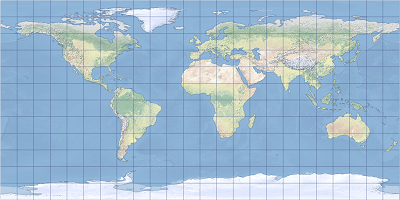

# Plate carrée

## Description
The plate carrée map projection is an equidistant cylindrical projection with the standard parallel located at the equator. A grid of parallels and meridians forms perfect squares from east to west and from pole to pole. It is one of the simplest and oldest map projections, and therefore its usage was more common in the past. The radius is used as a conversion factor between angular and linear units. Another usage of this projection is to display spatial data stored in a geographic coordinate system, known as the pseudo-plate carrée projection.

The projection was invented by Marinus of Tyre around A.D. 100. It is available in ArcGIS Pro 1.0 and later and in ArcGIS Desktop 8.0 and later.

The plate carrée map projection is shown centered on Greenwich.

## Projection properties
The subsections below describe the plate carrée projection properties.

### Graticule
Plate carrée is a cylindrical projection. The meridians and parallels are equally spaced straight lines forming a Cartesian grid of perfect squares in the normal aspect. In this projection, the poles are represented as straight lines across the top and bottom of the grid, the same length as equator. The graticule is symmetrical across the equator and the central meridian.

### Distortion
The plate carrée projection in the normal aspect is equidistant along any meridian and the equator. Shape, scale, and area distortion increase with the distance from the equator. North, south, east, and west directions are always accurate, but general directions are distorted, except locally along the equator. Distortion values are symmetrical across the equator and the central meridian. In oblique aspects, all vertical lines are equidistant when used with sphere-based Earth models.

### Usage
This projection can be used for simple portrayals of the world or regions with minimal geographic data and those not requiring accurate areas. This makes the projection useful for index maps and to map phenomena that change with longitude, for example, time zones. Most often, data in a geographic coordinate system is displayed in a pseudo-plate carrée projection in which the decimal degree values are treated as if they are linear.

### Variants
There are two variants of the plate carrée projection available in ArcGIS:

+ Plate carrée is available in ArcGIS Pro 1.0 and later and in ArcGIS Desktop 8.0 and later.
+ Plate carrée oblique is available in ArcGIS Pro 2.9 and later and in ArcGIS Desktop 10.8.2 and later.

The plate carrée oblique version supports oblique variations of this projection. Both implementations support sphere-based Earth models and use the semimajor axis and spherical equations for ellipsoids.

### Limitations
The projection is supported on spheres only. For an ellipsoid, the semimajor axis is used for the radius. Some distortion properties are not maintained in oblique aspects or when ellipsoidal-based Earth models are used.

### Parameters
Plate carrée parameters are as follows:
+ False Easting
+ False Northing
+ Central Meridian

Plate carrée oblique parameters are as follows:
+ False Easting
+ False Northing
+ Azimuth
+ Longitude Of Center
+ Latitude Of Center

# 简易圆柱 (Plate Carrée) 投影

## 描述
简易圆柱投影是一种等距圆柱投影，其标准纬线位于赤道处。 经纬线的格网从东到西并从极点到极点形成完美的方形。 该投影是最简单和最古老的地图投影之一，因此在过去它的使用更为普遍。 半径将用作角度单位和线性单位之间的转换因子。 此投影的另一种用法是显示存储在地理坐标系中的空间数据，称为伪简易圆柱投影。

该投影于公元 100 年左右由 Marinus of Tyre 发明。 它适用于 ArcGIS Pro 1.0 及更高版本以及 ArcGIS Desktop 8.0 及更高版本。

显示了以格林威治为中心的简易圆柱地图投影。

## 投影属性
以下小节描述了简易圆柱投影的属性。

### 经纬网
简易圆柱投影是一种圆柱投影。 经线和纬线是等距的直线，由此可在法线方向上形成一个完美的笛卡尔方形格网。 在此投影中，各极点被表示为通过格网顶部和底部的直线，长度与赤道相同。 经纬网沿赤道和中央经线对称。

### 畸变
法线方向上的简易圆柱投影沿任何经线和赤道等距。 形状、比例和面积的畸变会随着距赤道距离的增加而增加。 东、西、南、北方向始终是精确的，但除沿赤道的局部区域外，常规方向会发生畸变。 畸变值沿赤道和中央经线对称。 在斜轴投影中，与基于球体的地球模型一起使用时，所有垂直线均等距。

## 用法
该投影用于以最少的地理数据简单绘制世界或地区地图，以及绘制不需要精确面积的世界或地区地图。 因此，此投影适用于索引地图以及用于绘制随经度变化的现象，例如时区。 **在大多数情况下，将以简易圆柱投影显示地理坐标系中的数据，其中十进制度值将视为线性值。**

## 变体
ArcGIS 中有两种可用的简易圆柱投影变体。
+ 简易圆柱投影适用于 ArcGIS Pro 1.0 及更高版本以及 ArcGIS Desktop 8.0 及更高版本。
+ 简易圆柱斜轴投影适用于 ArcGIS Pro 2.9 及更高版本以及 ArcGIS Desktop 10.8.2 及更高版本。

简易圆柱斜轴投影版本支持此投影的斜轴变体。 这两种实施均支持基于球体的地球模型并将长半轴和球面方程用于椭圆体。

## 局限性
此投影仅适用于球体。 对于椭圆体，长半轴将用于半径。 在斜轴投影中或在使用椭圆体的地球模型时，将无法保持某些畸变属性。

## 参数
简易圆柱投影参数如下：
+ 东偏移量
+ 北偏移量
+ 中央经线

简易圆柱斜轴投影参数如下：
+ 东偏移量
+ 北偏移量
+ 方位角
+ 中心经度
+ 中心纬度

## 资源
Snyder, J. P. (1987). Map Projections: A Working Manual. U.S. Geological Survey Professional Paper 1395. Washington, DC: United States Government Printing Office.

Snyder, J. P. (1993). Flattening the Earth. Two Thousand Years of Map Projections. Chicago and London: University of Chicago Press.

Snyder, J. P. and Voxland, P. M. (1989). An Album of Map Projections. U.S. Geological Survey Professional Paper 1453. Washington, DC: United States Government Printing Office.