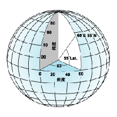
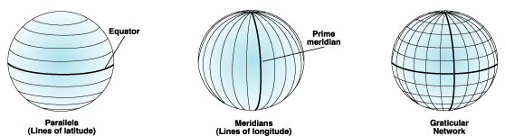
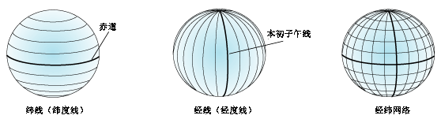

### What are geographic coordinate systems?
A geographic coordinate system (GCS) uses a three-dimensional spherical surface to define locations on the earth. A GCS is often incorrectly called a datum, but a datum is only one part of a GCS. A GCS includes an angular unit of measure, a prime meridian, and a datum (based on a spheroid).

A point is referenced by its longitude and latitude values. Longitude and latitude are angles measured from the earth's center to a point on the earth's surface. The angles often are measured in degrees (or in grads). The following illustration shows the world as a globe with longitude and latitude values.

Illustration of a globe with longitude and latitude values
In the spherical system, horizontal lines, or east–west lines, are lines of equal latitude, or parallels. Vertical lines, or north–south lines, are lines of equal longitude, or meridians. These lines encompass the globe and form a gridded network called a graticule.

The line of latitude midway between the poles is called the equator. It defines the line of zero latitude. The line of zero longitude is called the prime meridian. For most geographic coordinate systems, the prime meridian is the longitude that passes through Greenwich, England. Other countries use longitude lines that pass through Bern, Bogota, and Paris as prime meridians. The origin of the graticule (0,0) is defined by where the equator and prime meridian intersect. The globe is then divided into four geographical quadrants that are based on compass bearings from the origin. North and south are above and below the equator, and west and east are to the left and right of the prime meridian.

Illustration of parallels and meridians that form a graticule
This illustration shows the parallels and meridians that form a graticule.
Latitude and longitude values are traditionally measured either in decimal degrees or in degrees, minutes, and seconds (DMS). Latitude values are measured relative to the equator and range from -90° at the South Pole to +90° at the North Pole. Longitude values are measured relative to the prime meridian. They range from -180° when traveling west to 180° when traveling east. If the prime meridian is at Greenwich, then Australia, which is south of the equator and east of Greenwich, has positive longitude values and negative latitude values.

**It may be helpful to equate longitude values with X and latitude values with Y. Data defined on a geographic coordinate system is displayed as if a degree is a linear unit of measure. This method is basically the same as the Plate Carrée projection.**

[Learn more about the Plate Carrée projection](Plate_carrée.md)

Although longitude and latitude can locate exact positions on the surface of the globe, they are not uniform units of measure. Only along the equator does the distance represented by one degree of longitude approximate the distance represented by one degree of latitude. This is because the equator is the only parallel as large as a meridian. (Circles with the same radius as the spherical earth are called great circles. The equator and all meridians are great circles.)

Above and below the equator, the circles defining the parallels of latitude get gradually smaller until they become a single point at the North and South Poles where the meridians converge. As the meridians converge toward the poles, the distance represented by one degree of longitude decreases to zero. On the Clarke 1866 spheroid, one degree of longitude at the equator equals 111.321 km, while at 60° latitude it is only 55.802 km. Because degrees of latitude and longitude don't have a standard length, you can’t measure distances or areas accurately or display the data easily on a flat map or computer screen.

### 什么是地理坐标系？
地理坐标系 (GCS) 使用三维球面来定义地球上的位置。GCS 往往被误称为基准面，而基准面仅是 GCS 的一部分。GCS 包括角度测量单位、本初子午线和基准面（基于旋转椭球体）。

可通过其经度和纬度值对点进行引用。经度和纬度是从地心到地球表面上某点的测量角。通常以度或百分度为单位来测量该角度。下图将地球显示为具有经度和纬度值的地球。

具有经度和纬度值的地球插图
在球面系统中，水平线（或东西线）是等纬度线或纬线。垂直线（或南北线）是等经度线或经线。这些线包络着地球，构成了一个称为经纬网的格网化网络。

位于两极点中间的纬线称为赤道。它定义的是零纬度线。零经度线称为本初子午线。对于绝大多数地理坐标系，本初子午线是指通过英国格林尼治的经线。其他国家/地区使用通过伯尔尼、波哥大和巴黎的经线作为本初子午线。经纬网的原点 (0,0) 定义在赤道和本初子午线的交点处。这样，地球就被分为了四个地理象限，它们均基于与原点所成的罗盘方位角。南和北分别位于赤道的下方和上方，而西和东分别位于本初子午线的左侧和右侧。

构成经纬网的经线和纬线插图
此图显示了构成经纬网的经线和纬线。
通常，经度和纬度值以十进制度为单位或以度、分和秒 (DMS) 为单位进行测量。维度值相对于赤道进行测量，其范围是 -90°（南极点）到 +90°（北极点）。经度值相对于本初子午线进行测量。其范围是 -180°（向西行进时）到 180°（向东行进时）。如果本初子午线是格林尼治子午线，则对于位于赤道南部和格林尼治东部的澳大利亚，其经度为正值，纬度为负值。

**用 X 表示经度值并用 Y 表示纬度值可能会有帮助。这样，显示在地理坐标系上定义的数据就如同度是线性测量单位一样。此方法与普通圆柱投影基本相同。**

[了解有关普通圆柱投影的详细信息](Plate_carrée.md)

尽管使用经度和纬度可在地球表面上定位确切位置，但二者的测量单位是不同的。只有在赤道上，一经度所表示的距离才约等于一纬度所表示的距离。这是因为，赤道是唯一一条长度与经线相同的纬线。（其半径与球面地球半径相同的圆称为大圆。赤道和所有经线都是大圆。）

在赤道上方和下方，用来定义纬度线的圆将逐渐变小，直到最终在南极点和北极点处变为一个点，所有经线均在此处相交。由于经线沿极点方向逐渐集中，所以一经度所表示的距离最终将减小为零。在 Clarke 1866 旋转椭圆体上，赤道上的一经度等于 111.321 km，而在纬度为 60° 度位置，只有 55.802 km。因为经度和纬度不具有标准长度，所以无法对距离或面积进行精确测量，或者无法很容易地在平面地图或计算机屏幕上显示数据。