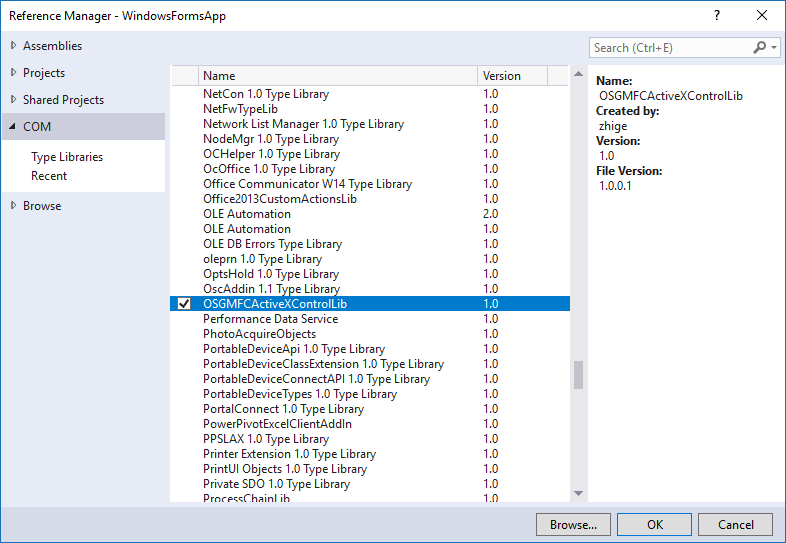
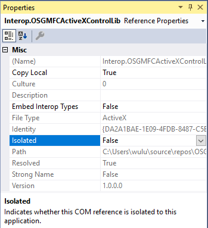

# MFC Activex Control 在Visual Studio 2017中编译测试及注意要点

最近需要将osg封装到COM中，以供winform来调用，研究了MFC Ativex，出现了一些问题，记录如下。

--------------------------------------------------
## 系统环境

|`Windows`|`Visual Studio`| 
|-|-|
|EN 10 Pro 1709 16299.64|Community 2017 15.4.4|

## MFC Activex
新建MFC Activex项目，默认是在界面上绘制一个椭圆，修改Platform为x64，General设置为默认。


Linker中的General配置中，修改Register Output为No，以免在每次生成时需要注册ocx，Visual Studio注册ocx需要管理员权限，非管理员权限运行时会报错。


## 注册ocx
build之后，在输出目录x64/Release中，生成OSGMFCActiveXControl.ocx，以**管理员权限**启动cmd，用regsvr32命令注册ocx。


## winform测试项目
新建winform项目对COM组件进行测试。右键点击项目Reference，点击Add Reference，打开引用管理器，找到COM中Type Libraries，选择刚才注册的ocx



## 手动修改引用
添加完引用后，生成时会在obj中生成一个Interop.XXXXX.dll，**此时在引用中会多出OSGMFCActivexControlLib，本应该还有一个AxOSGMFCActivexControlLib，以及在obj中有一个AxInterop.XXXXX.dll，但是都没有出现，需要手动添加。**
使用文本编辑器打开项目的项目文件，即.csproj文件，添加一个Ax开头的COMReference，直接找到OSGMFCActivexControlLib节点复制，粘贴在其同一父节点下，修改Include属性值为AxOSGMFCActivexControlLib，WrapperTool为aximp，如下


保存.csproj文件，此时Visual Studio会提示项目需要重新加载，重新加载后，修改引用中OSGMFCActivexControlLib的属性，Isolated为False，Embed Interop Types为False，项目引用如下



## Form中添加ocx控件
打开Form1的设计文件Desiger.cs，声明一个AxOSGMFCActivexControl对象，并初始化，加入form的控件中
```csharp
protected AxOSGMFCActiveXControlLib.AxOSGMFCActiveXControl AxOSGMFCActiveXControl;

this.AxOSGMFCActiveXControl = new AxOSGMFCActiveXControlLib.AxOSGMFCActiveXControl();

this.Controls.Add(this.AxOSGMFCActiveXControl);

```
在button的click事件中，加上ocx的about方法，弹出关于界面
```csharp
private void button1_Click(object sender, EventArgs e)
{
    AxOSGMFCActiveXControl.AboutBox();
}
```
编译之后，打开生成的exe文件，点击按钮，打开关于界面。


**每次在修改了MFC Activex的代码，重新生成C++项目后，需要重新注册ocx，winform项目要Rebuild，或clean后build**