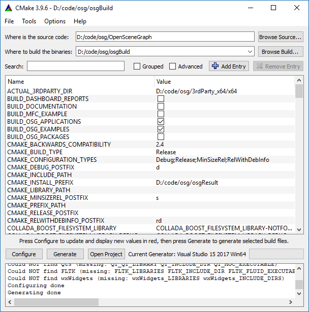

# osg 3.4.1 编译

## 下载
1. osg源代码下载，osg网站位置[http://www.openscenegraph.org/index.php/download-section/stable-releases](http://www.openscenegraph.org/index.php/download-section/stable-releases "osg download website")，本文中下载的是稳定版3.4.1，由于osg代码托管在GitHub上，具体地址为[https://github.com/openscenegraph/OpenSceneGraph/tree/OpenSceneGraph-3.4.1](https://github.com/openscenegraph/OpenSceneGraph/tree/OpenSceneGraph-3.4.1 "osg github repo")

2. osg第三方依赖库下载，第三方依赖库在osg网站上的位置[http://www.openscenegraph.org/index.php/download-section/dependencies](http://www.openscenegraph.org/index.php/download-section/dependencies "osg 3dparty website")，选择针对Visual Studio 2017的64位full package，具体地址为[https://download.osgvisual.org/3rdParty_VS2017_v141_x64_V11_full.7z](https://download.osgvisual.org/3rdParty_VS2017_v141_x64_V11_full.7z "osg 3dparty link") 

3. 数据包下载，osg网站地址[http://www.openscenegraph.org/index.php/download-section/data](http://www.openscenegraph.org/index.php/download-section/data "osg data website")，选择其中的OpenSceneGraph-3.4 standard dataset，下载地址为[http://www.openscenegraph.org/downloads/stable_releases/OpenSceneGraph-3.4.0/data/OpenSceneGraph-Data-3.4.0.zip](http://www.openscenegraph.org/downloads/stable_releases/OpenSceneGraph-3.4.0/data/OpenSceneGraph-Data-3.4.0.zip "osg data link")

4. 编译工具CMake下载，官方网站https://cmake.org/，进入下载页面[https://cmake.org/download/](https://cmake.org/download/ "cmake website")后选择Latest Release 3.9.6，windows 64位，installer安装版或zip绿色版均可，本文中下载的是zip绿色安装版，地址为[https://cmake.org/files/v3.9/cmake-3.9.6-win64-x64.zip](https://cmake.org/files/v3.9/cmake-3.9.6-win64-x64.zip "cmake link")

## 准备
建立osg文件夹，然后下载后的文件解压并组织文件夹如下：

D:\code\osg\3rdParty_x64，存放第三方依赖库，**由于直接解压3rdParty_VS2017_v141_x64_V11_full.7z文件得到的3rdParty_x64文件夹中还有一个x64文件夹，所以第三方库的实际地址为D:\code\osg\3rdParty_x64\x64，在配置Cmake会用到**

D:\code\osg\OpenSceneGraph 存放源代码

D:\code\osg\osgBuild 存放vs工程文件

## Cmake配置
打开cmake-gui.exe文件，where is the source code浏览到D:\code\osg\OpenSceneGraph，where to build the binaries浏览到D:\code\osg\osgBuild，点击Configure按钮，开始配置。

选择Visual Studio 15 2017 Win64，点击Finish按钮，完成此项配置。

修改*ACTUAL_3RDPARTY_DIR*为D:/code/osg/3rdParty_x64/x64，*CMAKE_INSTALL_PREFIX*为D:\code\osg\osgResult，*BUILD_OSG_EXAMPLES*修改为勾选，再次点击Configure按钮，进行配置，

点击Generate按钮，生成vs项目，生成完成之后，消息会弹出Generating done

点击Open Project直接打开Visual Studio 2017，文件夹如图

## 编译
**重点**：这个版本中的Plugins nvtt项目中的依赖项不全，直接编译会报错，需在项目的属性中修改，Property->Linker->Input，添加对nvtt.lib、nvimage.lib、nvmath.lib、nvthread.lib、nvcore.lib、squish.lib、bc6h.lib、bc7.lib，对于Release，Debug版本都需修改，在上述依赖项名称后添加“_d”即为Debug版本文件名称。

修改INSTALL项目属性，Property->Build Events->Post-Build Event，将Use In Build项修改为No，Release、Debug都需修改

vs菜单打开Build->Batch Build，生成All_Build,INSTALL的Debug，Release四个项目，

点击Build按钮，开始生成，第一次生成比较耗时，需要二至三个小时。

test ssh?????

