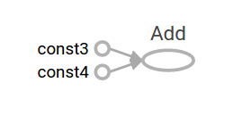
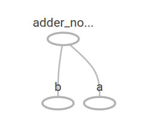
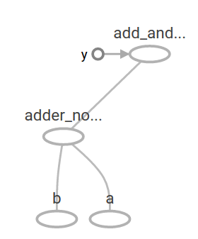

# 开始TensorFlow
本篇指南的目的是让你了解在TensorFlow中编程。在使用本篇指导之前，[安装TensorFlow](https://www.tensorflow.org/install/index)。为了充分利用本篇指南，读者应当了解以下几点：
* 如何使用Python编程。
* 至少关于数组的了解。
* 理想情况下关于机器学习的一些东西。但是，如果你只知道一点或者完全不了解机器学习，那么本篇指南仍然是你首先应该阅读的。

TensorFlow提供了许多APIs。最底层的API--TensorFlow Core--提供给你完整的编程控制。我们推荐TensorFlow Core给机器学习研究者和其他需要对他们的模型进行良好的控制的人。较高级别的API都是建立在TensorFlow Core之上的。较高级别API通常比TensorFlow Core更容易学习和使用。此外，较高级别的API使重复任务在不同用户之间更容易，更一致。较高级别的API例如`tf.contrib.learn`帮你管理数据集，估计，训练和推理。需要注意的是有一些较高级别的API--方法名中包含`contrib`--仍然还在开发之中。在接下来的TensorFlow版本中一些`contrib`方法可能会改变或过时。

本指南从TensorFlow Core教程开始。后面我们会演示如何用`tf.contrib.learn`实现相同的模型。了解TensorFlow Core原则有助于建立心理模型关于在使用更紧凑更高级的API的内部是如何实现。

# Tensors
TensorFlow中数据的中央单元是tensor（张量）。tensor由一组形成任意维度的原始值组成。tensor的rank是维度的数量。下面是一些tensor的例子：
```
3 # a rank 0 tensor; this is a scalar with shape []
[1., 2., 3.] # a rank 1 tensor; this is a vector with shape [3]
[[1., 2., 3.], [4., 5., 6.]] # a rank 2 tensor; this is a matrix with shape [2, 3]
[[[1., 2., 3.]],[[7., 8., 9.]]] # a rank 3 tensor with shape [2, 1, 3]
```

# TensorFlow Core tutorial
## Importing TensorFlow
TensorFlow程序的规范导入声明如下：
```py
import tensorflow as tf
```
这使Python可以访问Tensor的所有类，方法和符号。大多数文档假定你已经完成了这一步。
## The Computational Graph
你可能会认为TensorFlow Core程序由两个独立的部分组成：
1. 构建计算图。
2. 运行计算图。

**计算图computational graph**是一系列排列成节点图的TensorFlow操作。让我们来构建一个简单的计算图。每个节点使用零个或多个tensor作为输入并产生一个tensor作为输出。一种节点类型为常量。就像所有的TensorFlow常量，它没有输入，输出的值为它内部存储的值。我们可以创建两个浮点Tensor即`node1`和`node2`如下：
```py
node1 = tf.constant(3.0, tf.float32)
node2 = tf.constant(4.0) # also tf.float32 implicitly
print(node1, node2)
```
最后的print输出：
```py
Tensor("Const:0", shape=(), dtype=float32) Tensor("Const_1:0", shape=(), dtype=float32)
```
注意打印节点并没有像你预期的那样输出值`3.0`和`4.0`。相反，这些节点在评估（evaluated）的时候分别产生值3.0和4.0。要实际评估节点，我们必须在**会话session**中运行计算图。会话封装了TensorFlow运行时的控制和状态。
下面的代码创建了一个`Session`对象并调用它的`run`方法运行计算图来评估`node1`和`node2`，在会话中运行计算图如下：
```py
sess = tf.Session()
print(sess.run([node1, node2]))
```
我们可以看到预期的值3.0和4.0：
```py
[3.0, 4.0]
```
我们可以通过结合`Tensor`节点和操作（操作Operations也是节点）来构建更加复杂的计算图。例如，我们可以将两个常量相加来产生一个新的图如下：
```py
node3 = tf.add(node1, node2)
print("node3: ", node3)
print("sess.run(node3): ", sess.run(node3))
```
最后两个print语句产生
```py
node3: Tensor("Add_2:0", shape=(), dtype=float32)
sess.run(node3): 7.0
```
TensorFlow提供了一个叫做TensorBoard的工具，可以展示计算图的图片。以下是一张关于TensorBoard如何可视化展示图的屏幕截图:



就这样，图并不是特别有趣，因为它经常产生一个常量结果。图可以通过接受外部输入使其参数化，这个叫做**占位符placeholders**。占位符是以后提供值的承诺。
```py
a = tf.placeholder(tf.float32)
b = tf.placeholder(tf.float32)
adder_noder = a + b # + provides a shortcut for tf.add(a, b)
```
前面的三行代码有一些像函数或者lambda表达式其中我们定义了两个输入参数（a和b）以及对它们的操作。我们可以通过使用`feed_dict`参数来实现对指定的Tesnsor提供具体的值给占位符，实现多样化的输入来评估图。
```py
print(sess.run(adder_node, {a: 3, b: 4.5}))
print(sess.run(adder_node, {a: [1, 3], b: [2, 4]}))
```
结果输出
```py
7.5
[3, 7]
```
在TensorBoard中，图如下：



我们可以通过添加其他操作来使计算图变得更加复杂，例如：
```py
add_and_triple = adder_node * 3.
print(sess.run(add_and_triple, {a :3, 4: 4.5}))
```
产生输出
```py
22.5
```
在TensorBoard中前面的计算图如下：



在机器学习中我们通常希望模型可以接受任意输入，例如上面的例子。为了使模型可训练，我们需要修改模型使其在同样的输入下得到新的输出。**Variables**可以让我们给图添加可训练的参数。它们通过一个类型和初始值构造：
```py
W = tf.Variable([.3], tf.float32)
b = tf.Variable([-.3], tf.float32)
x = tf.placeholder(tf.float32)
linear_model = W * x + b
```
当调用`tf.constant`时常量初始化，它们的值是不能改变的。在常量之外，变量在你调用`tf.Variable`时并没有初始化。要在TensorFlow中初始化变量，你必须显式的调用如下的特殊操作：
```py
init = tf.global_variables_initializer()
sess.run(init)
```
很重要的是要认识到`init`在TensorFlow子图中初始化所有全局变量的句柄。直到你调用`sess.run`，变量才被初始化。
由于`x`是占位符，所以我们可以同时用多个`x`的值来计算`linear_model`，如下：
```py
print(sess.run(linear_model, {x:[1,2,3,4]}))
```
产生的输出值如下：
```py
[ 0.          0.30000001  0.60000002  0.90000004]
```
我们已经创建了一个模型，但我们不知道它到底有多好。为了在训练数据上评估模型，我们需要一个`y`占位符来提供预期值，并且我们需要编写一个损失函数。
损失函数衡量的是现有模型距离提供的值有多远。对于线性回归我们使用标准损失模型，对现有模型和提供值之间的差的平方求和。`linear_model - y`创建了一个每个值都是对应误差的向量。我们调用`tf.square`来计算误差的平方。然后我们使用`tf.reduce_sum`来计算误差的平方和，创建了一个简单的标量来提取（抽象？）示例中误差：
```py
y=tf.placeholder(tf.float32)
squared_deltas=tf.square(linear_model-y)
loss=tf.reduce_sum(squared_deltas)
print(sess.run(loss,{x:[1,2,3,4],y:[0,-1,-2,-3]}))
```
产生损失值
```py
23.66
```
我们能够通过重新指定`W`和`b`的值来手动提升模型，例如完美值`-1`和`1`。变量的初始值由`tf.Variable`提供，但是可以使用像`tf.assign`这样的操作来改变。例如，`W=-1`和`b=1`是模型最理想的值，我们可以按照如下方式修改`W`和`b`：
```py
fixW=tf.assign(W,[-1.])
fixb=tf.assign(b,[1.])
sess.run([fixW,fixb])
print(sess.run(loss,{x:[1,2,3,4],y:[0,-1,-2,-3]}))
```
最终显示损失值为0：
```py
0
```
我们猜测到了`W`和`b`的“完美”值，但是机器学习的全部意义就是自动找到正确的模型参数。我们将在下一张展示如何达到这个目的。

